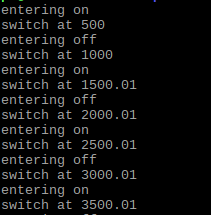

Final Project
---
I have developed 2 projects:
- [Vending Machine](https://github.com/mihirmodi29/vending-machine)
- [ELMA_Switch_Rpi](https://github.com/mihirmodi29/ELMA_Switch_Rpi)

# ELMA_Switch_Rpi (ELMA Project)

Project Goals
---
The goal of project is to implement a switching of light on and off using a UV sensor or switch button and Raspberry Pi. This project is extention of ELMA: https://github.com/klavinslab/elma. 
I will extend the given example https://github.com/klavinslab/elma/blob/master/examples/toggle-switch.cc to Rapberry Pi.

Project Success
---
When the UV sensor senses an object it will turn the red led light on or when the user presses the button it will turn the red led light on. 
When there is no object around it will turn green led light on or when the  user releases the button it will turn the green led light on.

Resources
---
- Rapberry Pi
- LED's
- Visual studio C++
- UV Sensor
- Switch Button
- ELMA

Milestones
---
- Setting up Raspberry pi 3. (3/12/2019)
- Setting up ELMA into Raspberry pi 3. (3/14/2019)
- Gathering sensors and LED's. (3/15/2019)
- Prototype phase 1 and run initial code to ensure Rpi is setup. (3/18/2019)
- Final setup and final code with sensor implementation. (3/20/2019)
- Documentation and final submission. (3/22/2019) 

# Change of Plans

- Setting up Raspberry pi 3. (3/12/2019)
- Setting up ELMA into Raspberry pi 3. (3/13/2019)
- Gathering sensors and LED's. (3/14/2019)
- Prototype phase 1 and run initial code to ensure Rpi is setup. (3/15/2019)
- Final setup and final code with led implementation. (3/16/2019)
- Due to unavailibility of UV sensor developed another project [Vending Machine](https://github.com/mihirmodi29/vending-machine)
- Implemented vending machine and refactoring elma-project (3/21/2019)
- Documentation and final submission. (3/23/2019) 

Progress Report (3/17/2019)
---
- I have setup my Raspberry pi with Raspbian OS. I have also used ELMA as library (https://github.com/klavinslab/elma) into my project from an example (https://github.com/klavinslab/elma_project). I have also gathered UV sensor along with LED's and developed starter code to blink LED's on and off. Currently I can blink LED on/off using WiringPi library. Next step is to set UV sensor and change state of LED depending on UV sensor output.  

Progress Report (3/23/2019)
---
- Due to limitation of implementing UV sensor I implemented blinking of led in raspberry pi and vending machine impleemntation as another project.

Installation
===

The source code for Elma [is on Github](https://github.com/klavinslab/elma).

First install required packages available through apt-get

    sudo apt-get update
    sudo apt-get install -y cmake
    sudo apt-get install -y cppcheck
    sudo apt-get install -y graphviz
    sudo apt-get install -y doxygen
    sudo apt-get install -y cmake
    sudo apt-get install -y libssl-dev

Next, install Google Test

    cd /usr/src
    sudo git clone https://github.com/google/googletest.git
    cd googletest
    sudo mkdir install
    cd install
    sudo cmake ../
    sudo make
    sudo make install

Next, install the json library

    sudo mkdir /usr/local/include/json
    cd /usr/local/include/json
    sudo curl -O -J -L https://github.com/nlohmann/json/releases/download/v3.5.0/json.hpp
    sudo mv json.hpp json.h

Next, install httplib

    cd /tmp
    git clone https://github.com/klavins/cpp-httplib.git
    sudo mkdir /usr/local/include/httplib
    sudo mv /tmp/cpp-httplib/httplib.h /usr/local/include/httplib

Now you should be ready to install elma:

    cd Desktop
    mkdir Code
    cd Code
    git clone https://github.com/klavinslab/elma.git
    cd elma
    make

Note that the Makefile should detect if you are on a pi by using the command

    uname -m
which on a pi 3 model B+ returns 'armv71'. If your pi is different, you might need to change the ifeq statments in `test/Makefile` and `examples/Makefile`.

If you would like to treat elma as a library, so you can link in other code, you should link to the relevant files in to the unversal system resources (usr) as follows:
```bash
ln -s include /usr/local/include/elma
ln -s lib/libelma.a /usr/local/lib/libelma.a
```
Then you can do 
```c++
#include "/home/pi/Desktop/Code/elma/include/elma.h" 
```
in your code and use the `-lelma` flag while linking. See the [example elma project](https://github.com/klavinslab/elma_project) for an example.

Now you should be ready to install ELMA_Switch_Rpi:

    cd Desktop
    cd Code
    git clone https://github.com/mihirmodi29/ELMA_Switch_Rpi
    cd ELMA_Switch_Rpi
    make

Architecture
---
Connect LED as follow to pin 11:

    
Execution
---
To run the ELMA_Switch_Rpi, type

    bin/toggle-switch

Result 
---



Acknowledgements
---
I would like to thank Prof. Klavins for the awesome coursework material. 

References
---
- https://github.com/klavinslab/elma_project

- https://github.com/klavins/ECEP520

- https://github.com/klavinslab/elma/blob/master/examples/toggle-switch.cc

- http://wiringpi.com/examples/blink/
License
===
This software is open source and uses the MIT license. Details can be found [here](https://github.com/mihirmodi29/ELMA_Switch_Rpi).
